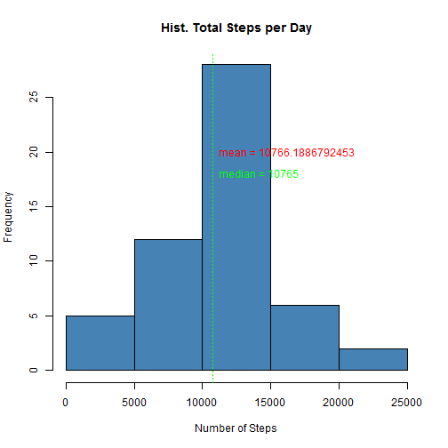
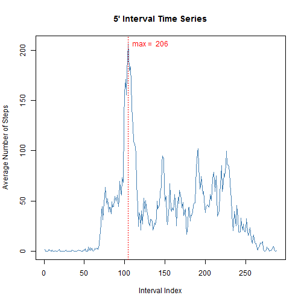
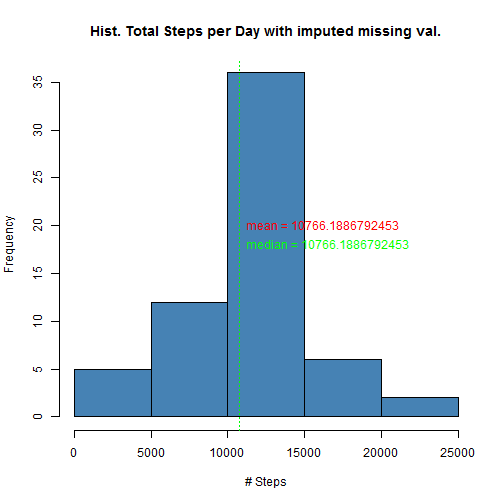
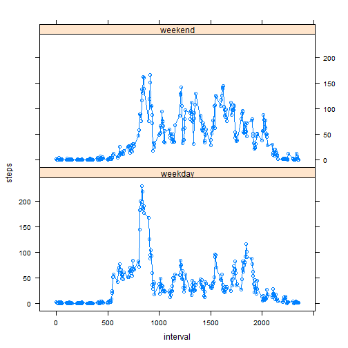

###Loading and pre-processing the data


```r
##ASSUME THE DATA FILE IS IN WORKING DIRECTORY
file <- "activity.csv"
data <- read.csv(file) #READ FILE                               #READ THE FILE
```

###What is mean total number of steps taken per day ?
We first remove missing data from dataset, then split the data per day in order to compute the total steps per day.
In addition, we calculate both mean and median.
Based on this, we create an histogram displaying Total Steps per Day, plus mean and median :

```r
completes <- data[!is.na(data$steps),] #CREATE DF REMOVING NA
incompletes <- data[is.na(data$steps),] #CREATE DF WITH NA ONLY
byDay <- split(completes, completes$date, drop=TRUE) #SPLIT COMPLETE DATA BY DAY
dailySteps <- sapply(byDay, function(x) sum(x$steps)) #COMPUTE SUM BY DAY

mean <- mean(dailySteps)
median <- median(dailySteps)

hist(dailySteps, main="Hist. Total Steps per Day", xlab="Number of Steps", col="steelblue")
abline(v=mean, lty=3, col="red")
abline(v=median, lty=3, col="green")
text(mean, 20, pos=4, labels=paste("mean =",mean), col="red")
text(median, 18, pos=4, labels=paste("median =",median), col="green")
```

 


###What is the average daily activity pattern ?
Here, we make a time series plot (type = "l") of the 5-minute interval (x-axis) and the average number of steps taken, averaged across all days (y-axis).
We also display which 5-minute interval, on average across all the days in the dataset, contains the maximum number of steps :

```r
byInterval <- split(completes, completes$interval, drop=TRUE)
intervAvg <- sapply(byInterval, function(x) mean(x$steps))

max <- which.max(intervAvg)
plot(intervAvg, type="l",  
     main="5' Interval Time Series", 
     ylab="Average Number of Steps", 
     xlab="Interval Index", col="steelblue") 
abline(v=max, lty=3, col="red") 
text(max,max(intervAvg),  
     labels=paste("max = ",as.character(round(max(intervAvg)))), 
     pos=4, col="red") 
```

 

###Imputing missing values

The total number of missing values in the dataset is 2304 :

```r
str(incompletes)
```

```
## 'data.frame':	2304 obs. of  3 variables:
##  $ steps   : int  NA NA NA NA NA NA NA NA NA NA ...
##  $ date    : Factor w/ 61 levels "2012-10-01","2012-10-02",..: 1 1 1 1 1 1 1 1 1 1 ...
##  $ interval: int  0 5 10 15 20 25 30 35 40 45 ...
```


The strategy for filling in all of the missing values in the dataset will be to use the mean for each 5-minute interval. We can see mean doe not change compare to previous value, while median is changing a little bit :


```r
DF <- as.data.frame(intervAvg)  #CREATE INTERIM DATAFRAME TO MANIPULATE ROWNAMES
DF$steps2 <- rownames(DF)       

for (n in 1:nrow(incompletes)){ #REPLACE MISSING VALUES W/ MEANS PER INTERVAL
        incompletes[n,1] <- DF[DF$steps2==incompletes[n,3],1]
}

newdata <- rbind(completes, incompletes)
newbyDay <- split(newdata, newdata$date, drop=TRUE) #SPLIT BY DAY
newdailySteps <- sapply(newbyDay, function(x) sum(x$steps)) #COMPUTE SUM BY DAY

newmean <- mean(newdailySteps)
newmedian <- median(newdailySteps)

hist(newdailySteps, main="Hist. Total Steps per Day with imputed missing val.", xlab="# Steps", col="steelblue")
abline(v=newmean, lty=3, col="red")
abline(v=newmedian, lty=3, col="green")
text(newmean, 20, pos=4, labels=paste("mean =",newmean), col="red")
text(newmedian, 18, pos=4, labels=paste("median =",newmedian), col="green")
```

 

###Are there differences in activity patterns between weekdays and weekends?

First, a new variable is created for each record with "weekend" or "weekday" value :

```r
newdata$date <- as.Date(strptime(newdata$date, format="%Y-%m-%d"))      #CONVERT DATE FORMAT
newdata$day <- weekdays(newdata$date)                                   #CREATE NEW VARIABLE

for (i in 1:nrow(newdata)) {                                            #CHECK IF WEEKEND
        if (newdata[i,]$day %in% c("Saturday","Sunday")) {            
                newdata[i,]$day<-"weekend"                                 
        }
        else{
                newdata[i,]$day<-"weekday"                                
        }
}
```

Then, number of steps are averaged by day and by interval index. In the end, using Lattice, a 2 rows wrapped graph is plotted. It shows different patterns between weekday and weekend.


```r
library(lattice)
library(data.table)


byweekday <- aggregate(newdata$steps, by=list(day=newdata$day, interval=newdata$interval), FUN=mean)
setnames(byweekday,3,c("steps"))
xyplot(steps ~ interval | day, data=byweekday, layout=c(1,2), type="b")
```

 
